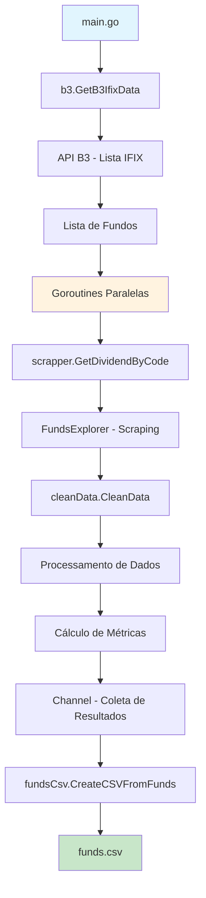

# IFIX Fund Scraper

Um scraper de fundos imobiliários brasileiros (FIIs) do índice IFIX que analisa dados de dividendos e preços para auxiliar em decisões de investimento.

## 📺 Video Tutorial

Assista ao tutorial completo em português no YouTube:
**[Como criar um scraper de FIIs em Go - Tutorial Completo](https://youtu.be/iRbsHPSSTvo?si=avgUJYFTjbfNoK9E)**

## 🚀 Como executar

```bash
# Instalar dependências
go mod tidy

# Executar o programa
go run main.go

# Executar testes
go test ./...

# Executar com cobertura
go test -cover ./...
```

## 📊 Fluxo da Aplicação



## 🏗️ Arquitetura

### Pacotes

- **b3/** - Busca lista de fundos IFIX na API da B3
- **scrapper/** - Web scraping usando Colly para coletar dados do FundsExplorer
- **cleanData/** - Processamento e limpeza de dados, cálculos financeiros
- **fundsCsv/** - Geração do arquivo CSV com os resultados

### Conceitos de Go Demonstrados

1. **Structs, pointers, funcs** - Estruturação de dados e funções
2. **Error handling** - Tratamento consistente de erros
3. **Testing e coverage** - Testes unitários com cobertura
4. **WaitGroups e Channels** - Concorrência e comunicação entre goroutines
5. **HTTP requests** - Requisições para APIs e web scraping
6. **Data scraping** - Extração de dados de páginas web
7. **CSV writing** - Escrita de dados estruturados em CSV

## 📈 Funcionalidades

- Coleta automática da lista de fundos do IFIX
- Scraping paralelo de dados de dividendos e preços
- Cálculo de yield e preço máximo baseado em taxa de desconto
- Exportação para CSV para análise posterior
- Processamento concorrente para otimização de performance
